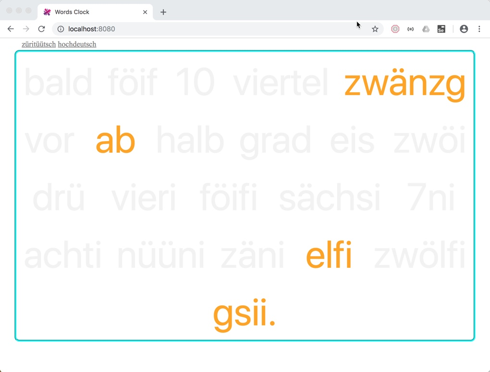
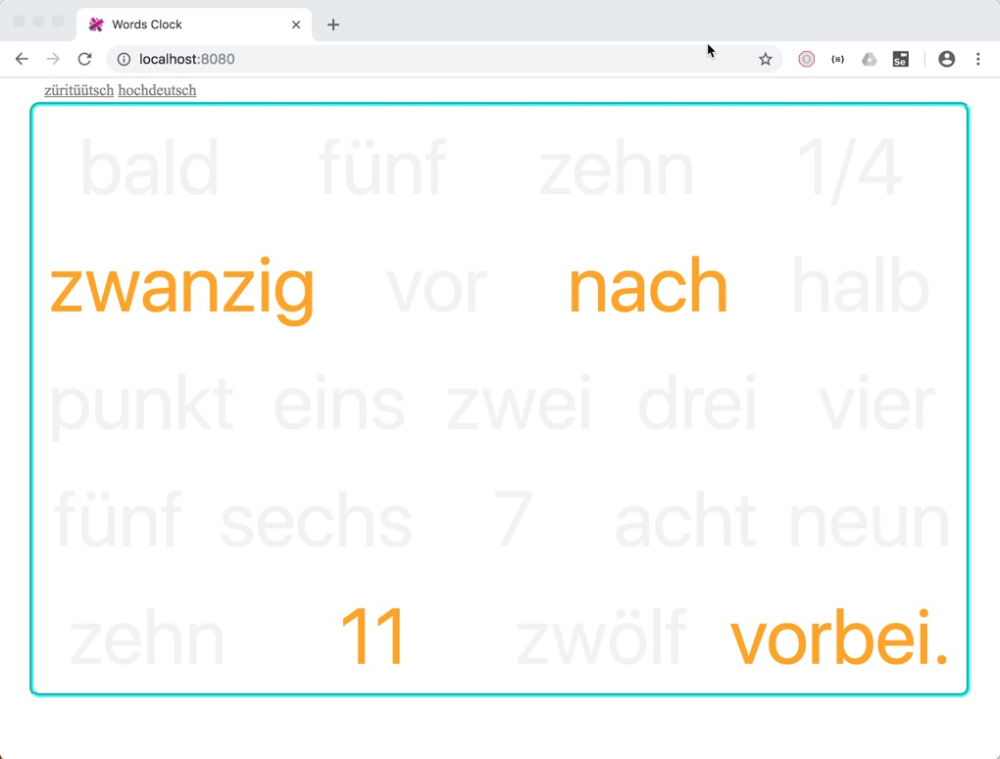

# Wörter-Uhr

Eine kleine Übung mit dem Web-Framework [Aurelia](http://www.aurelia.io).

Zeigt Grundgerüst, @autoinject, @inlineView, Webpack-Konfiguration, SCSS Stylesheet, Sprachumschaltung (I18N), Repeat-Patterns etc.

[Live Ansicht](http://webelexis.ch/uhr)

## Installation und Start:

     npm install -g aurelia-cli
     git clone https://github.com/rgwch/uhr
     cd uhr
     npm install
     au run --watch

Dann mit dem Browser auf http://localhost:8080 gehen.     

